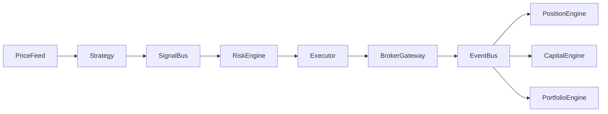

# 🚀 v1.0-event-core
Institutional-Grade Event-Driven Trading Core

---

## 🔷 Badges


---

## 📌 Overview

**v1.0-event-core** is a modular, event-driven trading engine designed for:
- Futures
- Equities
- FX
- Multi-asset portfolio trading

Built with extensibility, risk isolation, and institutional-grade architecture in mind.

---

## 🧠 Core Architecture

Event-driven, decoupled components:



---

## 🏗 Architecture Layers

```mermaid
flowchart TB
    subgraph Market Layer
        PriceFeed
        BrokerTransport
    end

    subgraph Core Engine
        EventBus
        Executor
        RiskEngine
        PortfolioEngine
    end

    subgraph State Layer
        PositionEngine
        CapitalEngine
        OrderBook
    end

    subgraph Persistence Layer
        Postgres
        EventStore
    end

    subgraph Strategy Layer
        NGStrategy
        MultiAssetStrategy
    end

    Strategy Layer --> Core Engine
    Core Engine --> State Layer
    Core Engine --> Market Layer
    Core Engine --> Persistence Layer
```

---

## 🧩 Component Responsibilities

| Component | Responsibility |
|------------|----------------|
| EventBus | Central async event routing |
| Strategy | Signal generation |
| RiskEngine | Position, order, daily loss validation |
| Executor | Order lifecycle management |
| BrokerGateway | Broker abstraction |
| PositionEngine | Position tracking |
| CapitalEngine | Cash, commission, tax accounting |
| PortfolioEngine | Cross-asset risk |
| Repository | Persistence abstraction |

---

## 📊 Risk Controls Included

- Max order size
- Max position size
- Daily realized loss limit
- Emergency stop
- Commission accounting
- Tax calculation
- Unrealized PnL calculation
- Equity tracking

---

## 🗂 Project Structure

```
v1.0-event-core/
│
├── core/
│   ├── event_bus.py
│   ├── executor.py
│   ├── risk_engine.py
│   ├── portfolio_engine.py
│
├── state/
│   ├── position_engine.py
│   ├── capital_engine.py
│   ├── order_registry.py
│
├── market/
│   ├── broker_gateway.py
│   ├── transports/
│
├── strategy/
│   ├── ng_strategy.py
│
├── persistence/
│   ├── repository.py
│   ├── postgres_repository.py
│
└── main.py
```

---

## 🛣 Roadmap

### v1.0
- [x] Event-driven architecture
- [x] Unified Risk Engine
- [x] PositionState v2
- [x] Capital accounting
- [x] Mock transport
- [x] Trading loop

### v1.1
- [ ] Async EventBus
- [ ] Backtest Engine
- [ ] Historical data feed
- [ ] Portfolio cross-margin risk

### v1.2
- [ ] Multi-asset strategies
- [ ] Risk-adjusted sizing
- [ ] Volatility-based position scaling
- [ ] Latency profiling

### v2.0
- [ ] Real broker integration (Finam gRPC)
- [ ] Postgres Event Store
- [ ] Parallel strategy execution
- [ ] Distributed execution cluster

---

## ⚙ Installation

```bash
git clone https://github.com/your-org/v1.0-event-core.git
cd v1.0-event-core
python -m venv venv
source venv/bin/activate
pip install -r requirements.txt
```

---

## 🧪 Run Demo

```bash
python main.py
```

---

## 🎯 Design Goals

- Zero circular dependencies
- Strict state isolation
- Fully testable components
- Broker-agnostic
- Portfolio-ready
- Extendable to hedge-fund architecture

---

## 📄 License

MIT License
